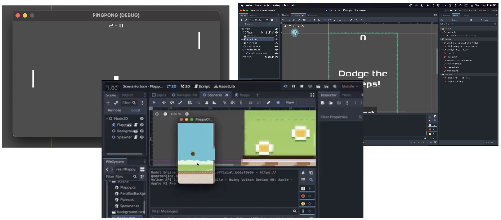

# My first projects with Godot

## Projects
### Pong
This is the clasic game of pong, made with Godot. It has a single player mode and an simple AI. To move the player press the keys and `Up` and `Down`.

### Flappy bird
This is a clone of the famous game Flappy Bird. To move the bird press or click the screen.

### Dodge the creeps
This is a simple game where you have to dodge the enemies, it's one of the tutorials of godot. To move the player press the keys and `Up`, `Down`, `Left` and `Right`.

<h3 align="center">Let's connect 😋</h3>

 &nbsp; &nbsp;
 &nbsp; &nbsp;
 &nbsp; &nbsp;
 &nbsp; &nbsp;

